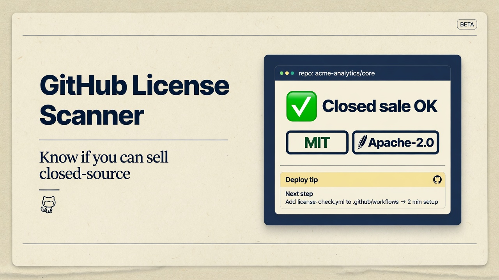
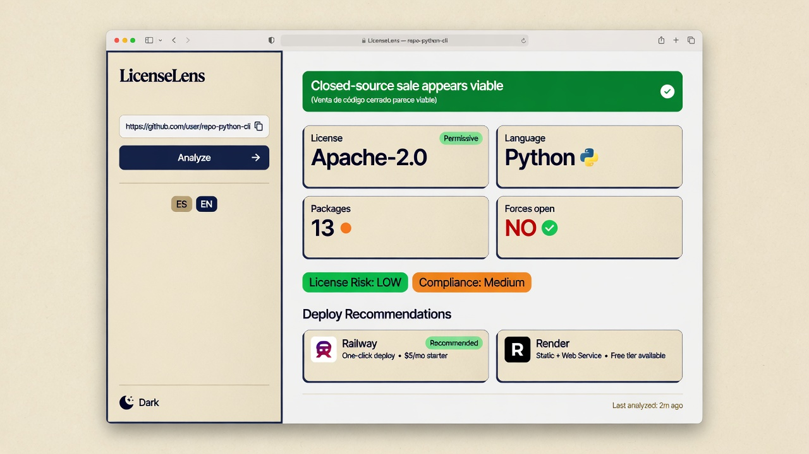
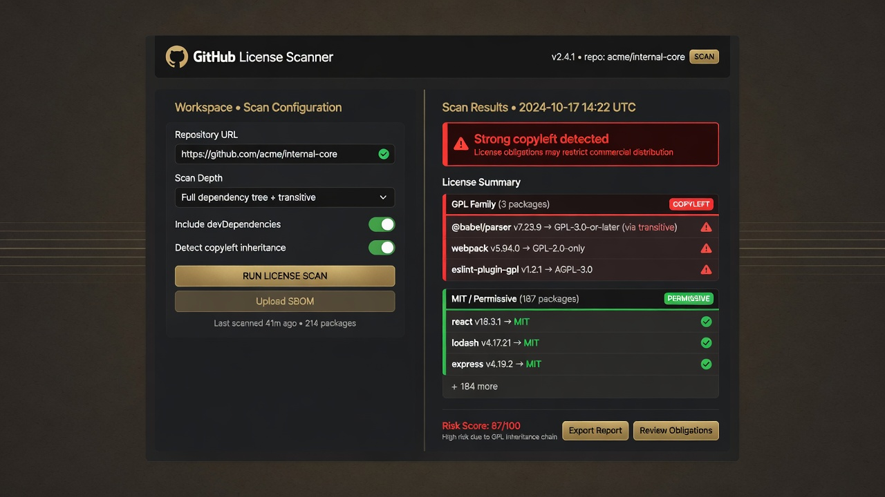
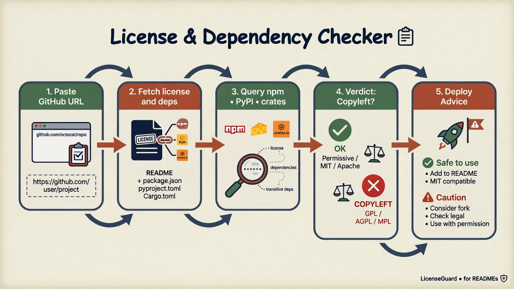

# GitHub License Scanner

<p align="center">
  
</p>

<p align="center">
  <strong>Analyze GitHub repo licenses + dependencies</strong><br/>
  Know if you can sell closed-source — or if copyleft (GPL / AGPL) forces open source.<br/>
  <em>NiceGUI web UI · CLI · bilingual ES/EN · light &amp; dark mode</em>
</p>

<p align="center">
  <a href="#quick-start"></a>
  <a href="#web-ui"></a>
  <a href="#cli"></a>
  <a href="#disclaimer"></a>
  <a href="LICENSE"></a>
</p>

---

## Screenshots

### Light workspace (full-width layout)

<p align="center">
  
</p>

### Dark mode

<p align="center">
  
</p>

### How it works

<p align="center">
  
</p>

| Step | What happens |
|------|----------------|
| 1 | Paste a GitHub URL (`owner/repo`) |
| 2 | Read repo license + dependency manifests |
| 3 | Look up package licenses on npm, PyPI, crates.io, … |
| 4 | Verdict: closed sale OK vs strong copyleft |
| 5 | Deploy tips + copyright notice to copy |

---

## Features

- **Repo license** via GitHub REST API  
- **Dependency scan** for `package.json`, `requirements.txt`, `pyproject.toml`, `Cargo.toml`, `go.mod`, `Gemfile`, `composer.json`, Maven/Gradle (best-effort)  
- **Registry license lookup** (npm, PyPI, crates.io, RubyGems, Packagist)  
- **Risk colors**: green (permissive) · orange (weak/unknown) · red (strong copyleft)  
- **Closed-source sellability** signal + GPL/AGPL force-open flag  
- **Permissive replacement** suggestions for problematic packages  
- **Batch mode** (many URLs) + **scan history**  
- **Copy copyright notice** button  
- **Deploy advisor** (Vercel, Railway, Render, Fly.io, …)  
- **ES / EN** UI · **light / dark** theme · **full-width** responsive layout  

---

## Quick start

```bash
git clone https://github.com/NezbiT/github-license-scanner.git
cd github-license-scanner

python -m venv .venv

# Windows
.venv\Scripts\activate

# macOS / Linux
# source .venv/bin/activate

pip install -r requirements.txt
```

Optional configuration (recommended):

```bash
# Copy example env and edit
cp .env.example .env   # Windows: copy .env.example .env

# PowerShell example
$env:GITHUB_TOKEN = "ghp_..."
$env:GLS_STORAGE_SECRET = "long-random-string"
```

| Variable | Purpose |
|----------|---------|
| `GITHUB_TOKEN` | Higher GitHub API rate limits / private repos |
| `GLS_STORAGE_SECRET` | Signs session cookies (**required** for public deploys) |
| `GLS_HOST` / `GLS_PORT` | Bind address (default `127.0.0.1:8080`) |
| `GLS_MAX_BATCH_URLS` | Cap batch scans (default 15) |
| `GLS_RATE_LIMIT_SCANS` | Scans per window per client (default 20/hour) |

See [`.env.example`](.env.example) for the full list.

---

## Web UI

```bash
python main.py
```

Open **[http://127.0.0.1:8080](http://127.0.0.1:8080)** (binds to localhost by default)

- Switch **ES | EN** in the top bar  
- Toggle **light / dark** with the sun/moon button  
- Try example chips (`psf/requests`, `encode/httpx`, …)  

---

## CLI

```bash
# Single repository
python cli.py scan https://github.com/psf/requests

# Shorthand
python cli.py scan psf/requests

# Batch (one URL per line)
python cli.py batch urls.example.txt

# History
python cli.py history
```

| Exit code | Meaning |
|-----------|---------|
| `0` | No strong copyleft force-open signal |
| `1` | Strong copyleft detected |
| `2` | Hard failure (bad URL, API error, …) |

---

## Project layout

```text
github-license-scanner/
├── main.py                 # NiceGUI interface
├── cli.py                  # Command-line mode
├── config.py               # Env-based configuration
├── rate_limit.py           # Scan rate limiter
├── github_api.py           # URL parse + GitHub REST
├── dependency_scanner.py   # Manifest parsers
├── license_analyzer.py     # Registry licenses + verdict
├── deploy_advisor.py       # Deploy recommendations
├── history_store.py        # JSON history (+ retention)
├── models.py               # Dataclasses
├── i18n.py                 # ES/EN strings
├── report.py               # Markdown export
├── requirements.txt
├── .env.example
├── urls.example.txt
└── docs/
    ├── LEGAL_DISCLAIMER.md
    ├── PRIVACY.md
    ├── TERMS.md
    └── images/             # README screenshots
```

---

## License risk legend

| Color | Risk | Examples |
|-------|------|----------|
| Green | Permissive | MIT, Apache-2.0, BSD, ISC |
| Orange | Weak copyleft / unknown | LGPL, MPL, EUPL, missing metadata |
| Red | Strong copyleft | GPL, AGPL, SSPL |

---

## Security & privacy notes

- Default bind is **localhost only** (`GLS_HOST=127.0.0.1`).
- Set a strong **`GLS_STORAGE_SECRET`** before exposing the UI.
- Scan history is **instance-local** and shared if multi-user — use **Clear history** or prune via config.
- Rate limits and batch caps reduce GitHub API abuse.
- Docs: [Privacy](docs/PRIVACY.md) · [Terms](docs/TERMS.md) · [Legal disclaimer](docs/LEGAL_DISCLAIMER.md)

---

## Disclaimer

This tool provides **automated heuristics only**. It is **not legal advice** and not a  
license-compatibility opinion. Dual-licensing, linking models, SaaS (AGPL/SSPL),  
attribution duties, and contracts can change obligations.  
Always review with a qualified attorney before commercial closed-source distribution.  
See [docs/LEGAL_DISCLAIMER.md](docs/LEGAL_DISCLAIMER.md).

---

## License

Released under the **[MIT License](LICENSE)**.

You may use, modify, and redistribute this project commercially or privately,  
as long as you keep the copyright and license notice. See `LICENSE` for full text.

> The MIT license applies to **this tool’s source code**.  
> It does **not** change the licenses of the GitHub repositories or packages you scan.

---

<p align="center">
  Made with NiceGUI · httpx · packaging
</p>
